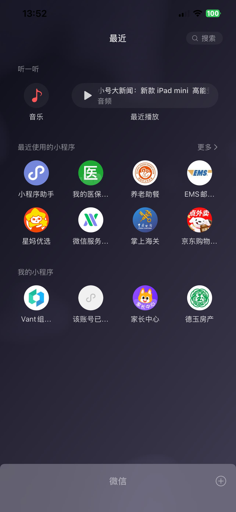
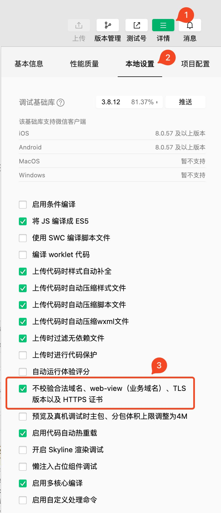

# 概述 {#wechat-mini-program-overview}

## 基础 {#basic}

### 什么是微信小程序 {#what-is-wechat-mini-program}

微信小程序是运行在微信平台上的应用程序，它可以在微信平台上直接运行，无需下载安装。

在微信中下拉搜索或扫描二维码即可打开小程序。

::: details 点击查看微信小程序列表

:::

### 注册账号 {#register-account}

注册账号需要先登录[微信公众平台](https://mp.weixin.qq.com/)，然后点击导航栏上的“立即注册”链接，选择“小程序”，再点击“注册小程序”。

注册账号使用邮箱注册，邮箱需要注意：

1. 未被微信公众平台注册
2. 未被微信开放平台注册
3. 未被个人微信号绑定

收到注册邮件后，点击微信发送的“验证”链接，继续注册流程。

### 基础配置 {#basic-configuration}

小程序账号注册成功后，需要打开微信公众平台对小程序账号进行一些设置：

1. 填写小程序名称、图标、类目等，方便后续提交审核和上线
2. 小程序备案和微信认证，只有通过备案的小程序才能上架

### 项目成员 {#project-members}

微信小程序人员分为 2 种：

1. 项目成员：开发者、运营人员、数据分析员
2. 体验成员：小程序未发布前体验小程序

## 创建项目 {#create-project}

### 创建流程 {#create-project-process}

1. 获取小程序 AppID

   对于开发者而言，在创建项目前，需要获取小程序的 AppID。

   在小程序后台，选择 “管理” -> “开发管理” -> “开发设置” 标签页下找到 “AppID（小程序 ID）”，一般以 `wx*` 开头。

2. 下载微信开发者工具

   微信开发者工具是一个用于开发微信小程序的工具，它可以在 PC 端进行开发，也可以在移动端进行开发。

   根据不同的操作系统下载对应的稳定版的开发者工具，下载地址：[微信小程序开发者工具](https://developers.weixin.qq.com/miniprogram/dev/devtools/download.html)

3. 扫码登录微信开发者工具

   下载好微信开发者工具后，打开开发者工具，使用绑定开发者账号的微信，扫码登录开发者工具。

   :::danger 注意
   不要使用“游客模式”登录开发者工具。
   :::

4. 创建项目

   - 点击 `+` 创建项目
   - 填写项目名称、项目目录
   - 选择 AppID、后端服务选择“不使用云服务”
   - 开发模式选择“小程序”
   - 点击“创建”按钮，即可创建项目。

### 本地开发支持 http {#local-development-support-http}

本地开发环境开发的接口一般是 http 协议，但是微信小程序默认不支持 http 协议，需要在小程序做一下简单配置，才能支持 http 协议。

创建完项目后，在微信开发者工具中，点击“详情” -> “本地设置” -> “项目设置” -> 勾选“不校验请求域名、TLS 版本及 HTTPS 证书”。

:::details 点击查看开启 http 协议的截图

:::

## 项目目录 {#project-directories}

下面是一个基础的 JS 项目目录结构：

```text
.
├── app.js
├── app.json
├── app.wxss
├── pages
│   ├── index
│   │   ├── index.js
│   │   ├── index.json
│   │   ├── index.wxml
│   │   └── index.wxss
│   └── logs
│       ├── logs.js
│       ├── logs.json
│       ├── logs.wxml
│       └── logs.wxss
├── project.config.json
├── project.private.config.json
├── sitemap.json
└── utils
    └── util.js
```

1. 项目主配置文件

   在项目根路径下，控制整个项目。

   - `app.js` 小程序入口文件，小程序启动会执行这个 JS 文件
   - `app.json` 小程序的全局配置，比如顶部颜色，顶部标题等
   - `app.wxss` 小程序全局样式，编写的样式全局生效

   ::: tip
   其中 `app.js` 和 `app.json` 是必须包含的。
   :::

2. 项目页面文件

   在 `pages` 目录下，每个页面都是一个文件夹，文件夹下包含一个 `.js` 文件、`.json`文件、`.wxml`文件和一个 `.wxss` 文件。

   - `.js` 文件：页面的逻辑文件，类似 JS 文件
   - `.json` 文件：页面的配置文件，比如页面的标题、导航栏等
   - `.wxml` 文件：页面的结构文件，类似 HTML 文件
   - `.wxss` 文件：页面的样式文件，类似 CSS 文件

   ::: tip
   其中 `app.js` 和 `app.wxml` 是必须包含的。
   :::

3. 其他文件

   - `project.config.json` 开发者工具默认配置
   - `project.private.config.json` 开发者工具用户配置
   - `sitemap.json` 微信收录页面，用于搜索，小程序上线后，搜索关键字就可以搜索到我们的小程序
   - `utils\utils.js` 工具函数文件，用于编写一些常用的函数，比如日期格式化、金额格式化等
